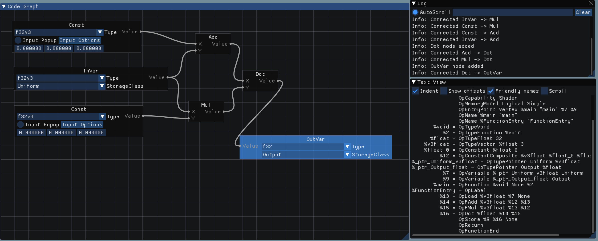

# Proto
Proof Of Concept SPIR-V Code Generator / Graph Editor GUI

This is my test playground project for my IR-builder library SpvGenTwo

## Usage

Use right click context menu to crate new nodes.
Click to select node.
Press DEL to delete a node.

Code will only be generated if control flow reaches output variables.

## Dependencies (Submodules)
* [SpvGenTwo](https://github.com/rAzoR8/SpvGenTwo)
* [ImGUI](https://github.com/ocornut/imgui)
* [ImNodes](https://github.com/rAzoR8/ImNodes)
* [GLFW](https://github.com/glfw/glfw)
* [SPIRV-Tools](https://github.com/KhronosGroup/SPIRV-Tools)
* [SPIRV-Headers](https://github.com/KhronosGroup/SPIRV-Headers)
* [Vulkan](https://www.lunarg.com/vulkan-sdk/)

## Building

Use the supplied CMakeLists.txt to generate project files for your build system.

# Copyright and Licensing

The Proto open source project is licensed under [MIT license](LICENSE).
Any contribution you make to this original repository shall be licensed under same license. You are still free to distribute your contributions (in your own fork) under the license you desire.